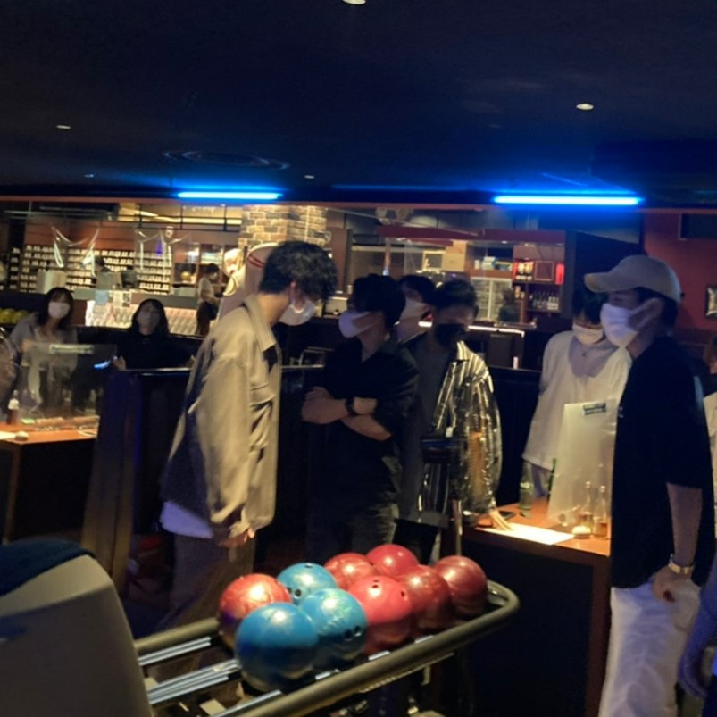

# yorosite
サイトの更新方法について記述しておきます。

## イベントの追加
ファイル名は100個目のイベントとしています。
*まず、`event0.html`中のコードををコピーし、新たに`event100.html`を作成し、貼り付けます。
```
<h2 class="title">Events<span>活動内容</span></h2>

<figure class="c mb30">

</figure>

<table class="ta1">
<caption>title</caption>
<tr>
<th>日時</th>
<td>20**/**/**</td>
</tr>
<tr>
<th>場所</th>
<td>********</td>
</tr>
</table>

<p>活動内容の説明</p>
	<p>サンプルテキスト。サンプルテキスト。サンプルテキスト。サンプルテキスト。サンプルテキスト。<br>
		サンプルテキスト。サンプルテキスト。サンプルテキスト。サンプルテキスト。サンプルテキスト。</P>
```
のなかを編集します。ページ右上のペンのマークを押すと編集モードになります。
  
---
```
<figure class="c mb30">

</figure>
```
はトップの写真です。横長の写真を使用してください。  
ファイル名は`event100_"任意".jpg`とし、`images`のディレクトリに保存しておいてください。  
上の部分はこのようになります。
```
<figure class="c mb30">

</figure>
```
  
---
```
<table class="ta1">
<caption>title</caption>
<tr>
<th>日時</th>
<td>20**/**/**</td>
</tr>
<tr>
<th>場所</th>
<td>********</td>
</tr>
</table>
```
は*の部分を編集してください。
```
---
<p>活動内容の説明</p>
	<p>サンプルテキスト。サンプルテキスト。サンプルテキスト。サンプルテキスト。サンプルテキスト。<br>
		サンプルテキスト。サンプルテキスト。サンプルテキスト。サンプルテキスト。サンプルテキスト。</P>
```

はサンプルテキストの部分を編集します。改行は`<br>`を使います。非推奨ですが`<br><br>`とすることで行間を開けることもできます。  

また、必要に応じて写真を追加します。その場合は一度`</p>`でpタグを閉じてから、imgタグを作ります。さらに文章を続けるにはpタグをまたつけます。
写真の挿入の仕方は上記参照。タグなどの説明は`HTML pタグ`などと検索してみてください。  

これで`event100.html`の編集は終了です。
  
---
*次に`works.html`を開き、編集していきます。
```
<div class="list">
<a href="event1.html">
<figure></figure>
<h4>記念すべき初回活動！</h4>
</a>
</div>
```
の部分をコピーして、そのまま下に貼り付けてください。
  
写真は正方形のものを使用して、ファイル名を`event100_top.jpg`とし、`images`のディレクトリに保存しておいてください。
```
<div class="list">
<a href="event100.html">
<figure></figure>
<h4>イベントのタイトル</h4>
</a>
</div>
```
このように編集して、`works.html`を保存します。
  
これでイベントの追加は終わりです。


## HOMEのWhat's newの追加

`index.html`を開き、編集していきます。
```
<dt>2021/9/21</dt>
	<dd>第1回の活動の様子を掲載しました。メニュー「<a href="works.html">Events</a>」よりご覧ください。<span class="newicon">NEW</span></dd>
```
上の部分をコピーして、そのまま下に貼り付けてください。リンクをつけるにはaタグを使います。
```
<span class="newicon">NEW</span>
```
は最新のもの、もしくは更新から１週間経っていないものにのみ付けます。
それ以外のニュースからは消してください。
